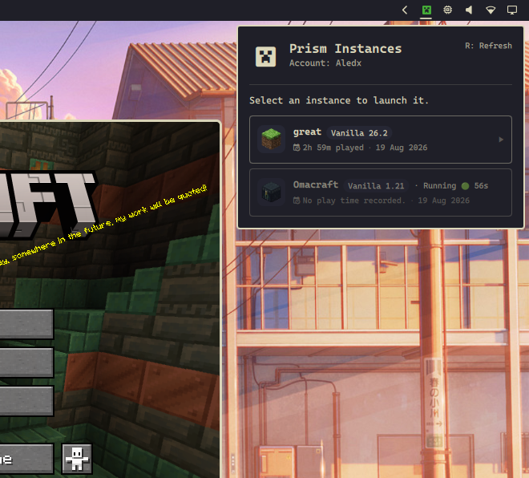
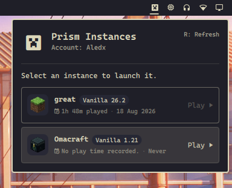

# 🎮 Prism Instances · Minecraft Worlds

> ⛏️ Launch your **Minecraft worlds** directly from the Omarchy bar with [Prism Launcher](https://prismlauncher.org/).

Click the `󰍳` icon to open your compact world launcher:

- 👤 Your active Prism account.
- ▶️ Direct launching through Prism Launcher's CLI.
- 🌍 Your Minecraft instances.
- 🧱 Minecraft version and mod loader for each world.
- ⏱️ Total play time and last played date.
- 🖼️ Optional custom instance icons.

## Preview



<div align="center">
  <p align="center">  </p>
</div>

## Requirements

> **Important:** Prism Launcher must already be installed on the system. This plugin does not install Prism Launcher or Minecraft for you.

The plugin detects either `prismlauncher` or `PrismLauncher` in `PATH` and uses Prism's default Linux data directory:

```text
~/.local/share/PrismLauncher/
```

If Prism Launcher is not installed, the bar icon remains available and the panel explains that Prism Launcher is required.

## Install

```sh
omarchy plugin add https://github.com/aledx18/prism-instances.git --enable
```

Then reload the Omarchy shell or restart the bar if the plugin does not appear immediately.

## Dependencies

- **Prism Launcher** must be installed and available as `prismlauncher` or `PrismLauncher` in `PATH`.
- **Bash** is required at runtime because the panel executes the scanner through Bash.
- **`jq`** is optional. When available, it enables Minecraft/loader version metadata and active account name detection.

The plugin does not install, configure, or remove Prism Launcher, Minecraft, or any system package.

## Remove

Remove it safely with:

```sh
omarchy plugin remove io.github.aledx18.prism-instances
```

Removing the plugin does not delete Prism Launcher instances, accounts, icons, or other user data.

## Instance icons

> **Note:** Built-in Prism icon themes are embedded inside Prism Launcher and are not exposed as regular image files to this plugin. To display an icon in the panel, assign a **custom PNG icon** to each instance in Prism Launcher.

The scanner looks for the icon named by `iconKey` in Prism's configured `IconsDir` (normally `~/.local/share/PrismLauncher/icons/`). For example, an instance with `iconKey=vanilla_custom` should have:

```text
~/.local/share/PrismLauncher/icons/vanilla_custom.png
```

Instances without a matching custom PNG continue to work; only the image area is omitted.

## Configuration

The scanner supports these environment variables:

- `PRISM_DATA_DIR` — override Prism's data directory.
- `PRISM_INSTANCES_DIR` — override the instances directory.

Prism's `IconsDir` setting is read automatically from `prismlauncher.cfg`.

## Privacy and safety

The plugin is read-only. It reads only:

- `instances/*/instance.cfg` for the instance ID, name, icon key, total play time, and last launch time.
- `instances/*/mmc-pack.json` for Minecraft and loader versions.
- `accounts.json` only for the active account's `profile.name`.
- `prismlauncher.cfg` only for the `IconsDir` location.
- The referenced custom icon image, when it exists.

It never reads account tokens, skins, saves, logs, or other account data. It does not write, delete, or modify Prism Launcher files or system files.

The optional Minecraft and loader metadata is read with `jq` when available. Instance discovery and launching continue to work without it.

## Development

```sh
omarchy plugin validate .
qmllint -I "$OMARCHY_PATH/shell" BarWidget.qml Panel.qml
```

## License

MIT
